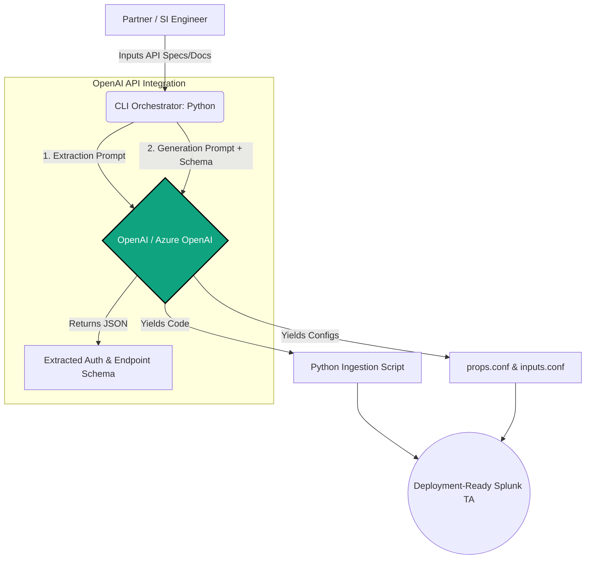
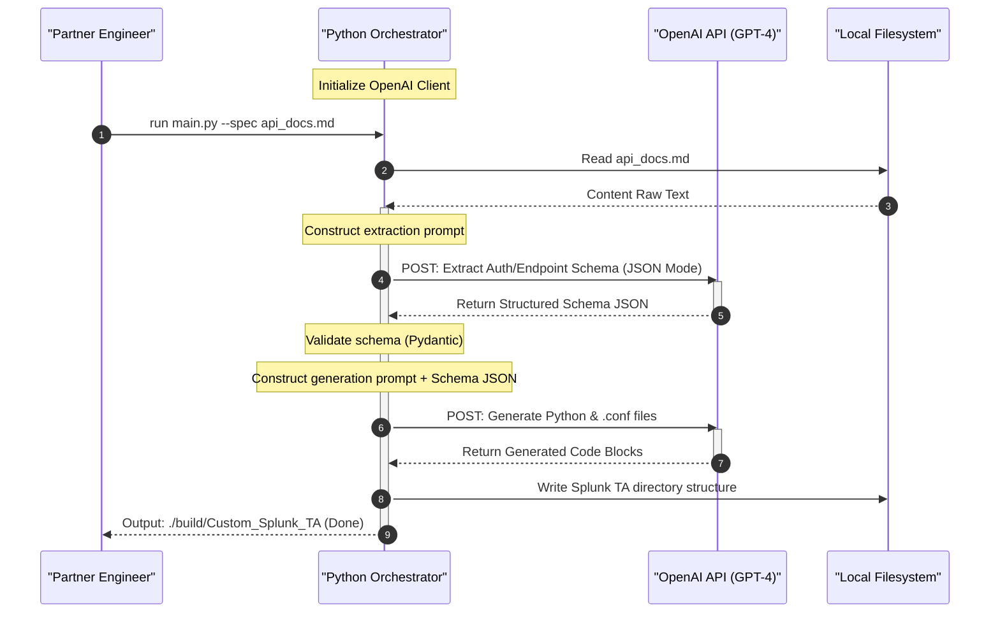

# ⚡ Zero to Splunk TA: GenAI Deployment Framework

[](https://python.org)
[](https://openai.com/)
[](https://opensource.org/licenses/MIT)

## Overview

**Zero to Splunk TA** is an AI deployment accelerator built to help Systems Integrators (SIs) and enterprise engineering teams transform API documentation into production-ready Splunk Technology Add-ons (TAs) in minutes, not days. 

By leveraging the **OpenAI API** and advanced prompt chaining, this framework codifies architectural best practices into a repeatable, automated pipeline. It mentors technical teams toward self-sufficiency by removing the friction of manual Python scripting and regex formulation, accelerating customer time-to-value for complex data ingest pipelines.

## 🏗️ Architectural Pattern

The framework utilizes a multi-pass agentic workflow to ensure deterministic, high-quality code generation.



 Detailed interaction sequence diagram in the README. The sequence diagram specifically shows how we handle the asynchronous data exchange with the OpenAI API to ensure deterministic code 
 generation.
 



## ✨ Key Features
Accelerated Deployment: Reduces the prototyping and implementation phase of custom Splunk integrations by 95%.

Agentic Prompt Chaining: Uses a two-pass approach with the OpenAI API—first extracting structured schema data, then generating the functional logic.

Production-Ready Artifacts: Automatically formats output into standard Splunk structures (inputs.conf, props.conf, and Modular Input Python scripts).

Provider Agnostic: Built on the official openai Python SDK, seamlessly adaptable between standard OpenAI endpoints and Azure OpenAI deployments.

## 🚀 Quick Start
Prerequisites
Python 3.9+

An active OpenAI API Key (or Azure OpenAI endpoint credentials) - we support both options, your .env file should looks like this
``` plain
Plaintext
# --- OpenAI Direct ---
OPENAI_API_KEY=sk-proj-xxxx...
OPENAI_MODEL=gpt-4o

# --- Azure OpenAI (Prioritized if uncommented) ---
AZURE_OPENAI_API_KEY= your key heree
AZURE_OPENAI_ENDPOINT=https://your-end-point-here.cognitiveservices.azure.com/
AZURE_OPENAI_API_VERSION=2024-12-01-preview 
AZURE_OPENAI_DEPLOYMENT_NAME=gpt-5.4-mini-3

```

### Installation
1. Clone the repository:
``` bash
git clone https://github.com/abokov/zero-to-splunk-ta-openai.git
cd zero-to-splunk-ta-openai
```

2. Install dependencies:

```Bash
pip install -r requirements.txt
```


3. Configure your environment:

```Bash
cp .env.example .env
# Edit .env and add your OPENAI_API_KEY```
```

4.  Usage
Run the CLI tool and pass the target API documentation or JSON spec:

```Bash
python src/main.py --spec ./examples/sample_api_doc.md --output ./build/MyCustomTA
```

The framework will process the spec and output a ready-to-deploy folder in the ./build directory.


###🧠 Why This Exists (Product Mindset)
Working directly with strategic SIs and enterprise customers, I identified a recurring bottleneck: deploying AI/ML analytics required ingesting niche data sources, which meant weeks of manual engineering for custom connectors. This tool is a codified solution package designed to eliminate that bottleneck, driving immediate business value and unlocking faster adoption of downstream AI/ML use cases.

### 🤝 Contributing
Contributions, issues, and feature requests are welcome! Feel free to check the issues page.

Contact: alex@bokov.net


